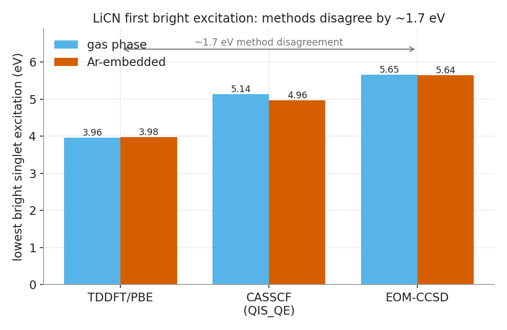
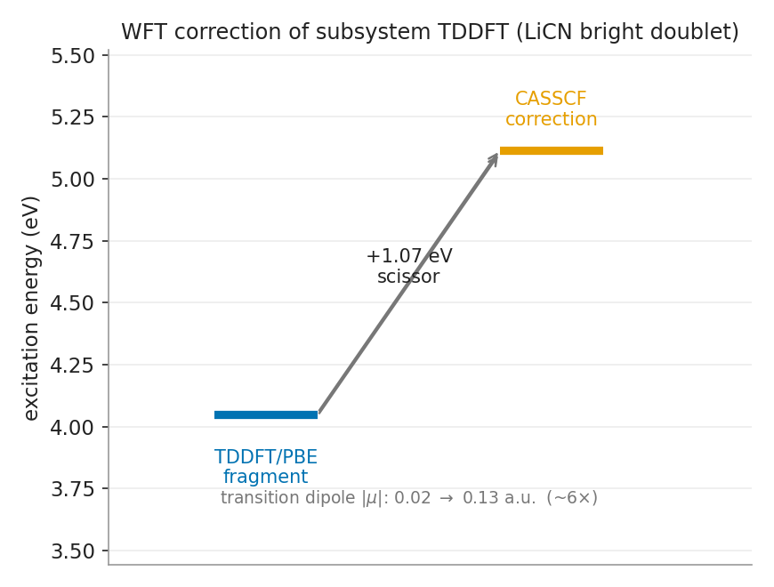
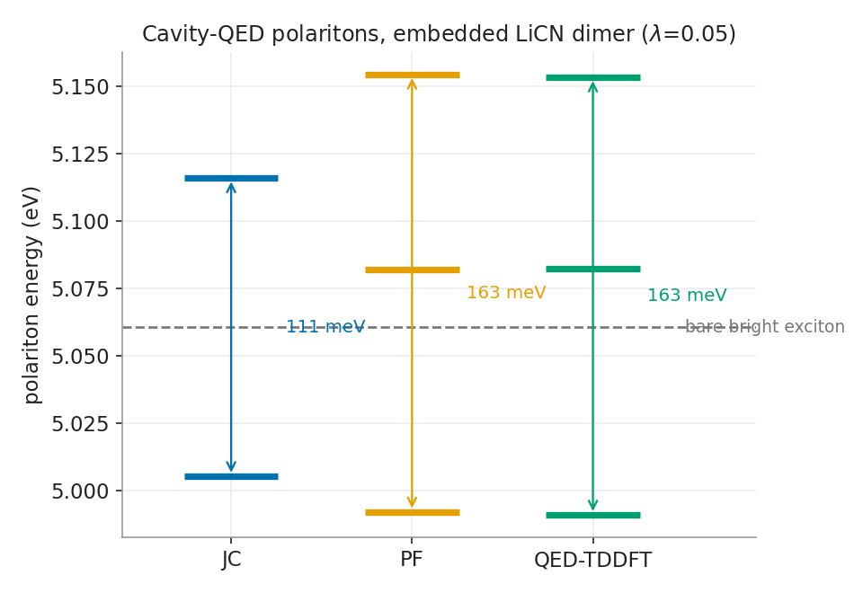

# qis_pw_qed — WFT-in-DFT embedding → active-space (qiskit/classical) → cavity QED

Results and drivers for a **wavefunction-in-DFT embedding** workflow on **LiCN in an
Ar matrix**: a plane-wave subsystem-DFT embedding (eDFTpy/QE) supplies an embedding
potential `v_emb(r)`; a Gaussian-basis PySCF fragment folds `v_emb` into its
one-electron Hamiltonian so **CASSCF / EOM-CCSD / qEOM** feel the matrix; the
resulting excitation energies + transition dipoles drive **Förster coupling** and
**cavity-QED** post-processing, and are used to **correct subsystem TDDFT**.

This repo holds **drivers and (small) results only**. The library code lives in
`casidapy` (plain-PySCF embedding + coupling + QED, qiskit-free) and `QIS_QE`
(qiskit exact-diagonalization / qEOM). Large binaries (`.snpy` potentials, raw QE
output) are **not** committed — see [Reproducing](#reproducing).

## Figures



*First bright singlet excitation of LiCN by **TDDFT/PBE**, **CASSCF** (via QIS_QE), and
**EOM-CCSD**, gas vs Ar-embedded. The three methods disagree by **~1.7 eV** — the core
motivation for correcting TDDFT with a wavefunction method. CAS(6,6)/cc-pVDZ, GTO embedding.*



*WFT correction of the subsystem-TDDFT fragment states: CASSCF scissors the LiCN bright
doublet up by **+1.07 eV** and enhances the transition dipole **~6×** (0.02→0.13 a.u.).
Only the on-site energies + dipoles are corrected; the TDDFT inter-fragment coupling is kept.*



*Cavity-QED polaritons of the embedded LiCN dimer (λ=0.05): the bright Frenkel exciton splits
into lower/upper polaritons. **JC** gives a clean **111 meV** Rabi splitting; **PF** and
**QED-TDDFT** give **~163 meV** plus the dipole-self-energy-shifted structure.*

## Where the results come from

| result file | system | embedding potential (`v_emb`) | methods |
|---|---|---|---|
| `results/gas_licn.json` | LiCN gas phase | none | CASSCF(6,6) [QIS_QE exact-diag + plain PySCF], EOM-CCSD, TDDFT/PBE |
| `results/embedded_licn.json` | LiCN in 26-Ar | `size_small/LiCN/sub_licn.snpy` | same three |
| `results/embedded_dimer_qed.json` | LiCN dimer in 18-Ar (5.31 Å) | `size_small/dimer_u/sub_licn_{a,b}.snpy` | embedded CASSCF → Förster → PF/JC/QED-TDDFT |
| `results/wft_corrected_subsystem_tddft.json` | LiCN dimer in Ar | same | CASSCF scissor-correction of embedded TDDFT (+ WFT dipoles) |
| `results/phase0_licn_gas_cas4_4.json` | LiCN gas, CAS(4,4) | none | exact-diag vs **qEOM** (VQE) cross-check |
| `results/provenance.json` | — | — | software/version stamp (also embedded in every result) |

The `v_emb` potentials are produced by **converged eDFTpy subsystem-embedding
ground-state runs** under `/projectsn/mp1009_1/am4655/pw_qed/subs_qed/size_small/`
(recipe: **norm-conserving ONCV Ar + `density-use_gaussians` + revAPBEK KEDF**;
USPP/PAW Ar diverge). Each result JSON records the exact `v_emb` source in `meta`.

## Software used

Ground-state plane-wave subsystem embedding (produces `v_emb.snpy`):
- **Quantum ESPRESSO** via **qepy** (`7.2.1rc0`); **eDFTpy** subsystem-DFT driver
  (`0.0.1.dev0`); **dftpy** (`2.2.1.dev26`) fields/grids.

Embedding bridge + active-space solvers (this repo's drivers):
- **PySCF** (`2.13.0`) with the **`v_emb`→`get_hcore` spline bridge** ported from
  [`JezsMartinez/pyscf@PRG_2026`](https://github.com/JezsMartinez/pyscf/tree/PRG_2026)
  into `casidapy.pyscf_embed` (injected at `get_hcore`, not `get_fock`, so
  CASSCF/CCSD post-HF Hamiltonians see the embedding).
- **casidapy** — plain-PySCF embedding, CASSCF/EOM-CCSD, Förster coupling, cavity
  QED (`run_qed_post`), and the WFT-correction of subsystem TDDFT (qiskit-free).
- **QIS_QE** ([commit `b0b402c`](https://github.com/animan95/QIS_QE) + local `src/`
  reorg) — qiskit active-space solvers: qubit exact-diagonalization and VQE+qEOM.
- **qiskit** `1.2.4`, **qiskit-nature** `0.7.2`, **qiskit-algorithms** `0.3.1`;
  numpy `1.26.4`, scipy `1.15.2`. Python 3.10, all in the `stddft` venv.

Exact versions/commit are captured in `results/provenance.json` and embedded in
every result under the `provenance` key.

## Layout
```
scripts/            driver / demo scripts (phase0, phase1, wft_correct_demo, qEOM slurm)
generate_results.py one-shot generator for the committed result set
plots.py            figures from results/*.json (Okabe-Ito, colorblind-safe)
provenance.py       software/version capture
results/*.json      committed results (small, provenance-stamped)
figures/*.png       committed figures (see above)
env_qis.sh          environment (module libs + venv + paths)
```

## Reproducing
1. Environment: `source env_qis.sh` (or the project `stddft` venv via
   `env_stddft.sh`) — brings up PySCF + qiskit + casidapy + `QIS_QE/src`.
2. `v_emb` potentials: run the eDFTpy ground state under
   `pw_qed/subs_qed/size_small/*` (ONCV Ar + `use_gaussians`) to regenerate the
   `sub_licn*.snpy` (not committed; ~2.7 MB each).
3. Results: `python generate_results.py` → writes `results/*.json`.

## Code split (design)
- **casidapy** stays **qiskit-free**: embedding (`pyscf_embed`), plain CASSCF/CCSD
  (`embed_wft`), coupling + QED (`subsystem_coupling`, `qed_post`).
- **QIS_QE** holds **all qiskit** (exact-diag via FermionicOp, qEOM/VQE) and
  imports casidapy for the embedding. Plain and qiskit CASSCF agree to ~6e-9 eV.
